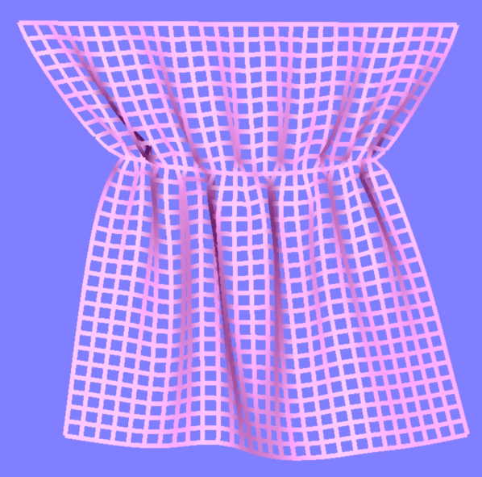

# Yarn-Level Cloth Simulator
Uses OpenGL 3.3

Dependent on GLAD, GLFW, and GLM

Use WASD to rotate the fabric.

Although I take into account which yarn is on top at each yarn crossing for the force calculations, I chose not to reflect this in the rendering. Unless I get around to rendering the yarns using splines, leaving out the offsets looks much nicer. Default parameters don't allow for much sliding, but this can be adjusted, as seen below.

